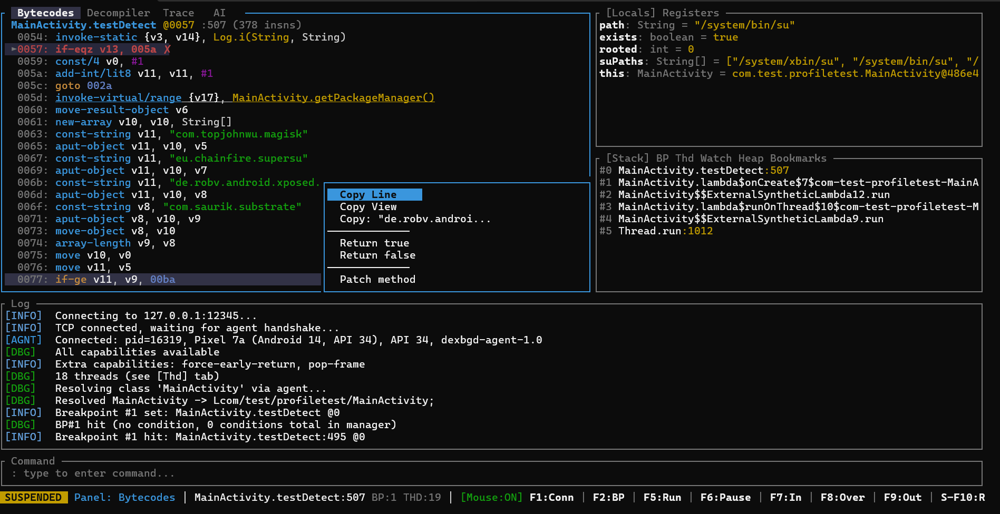

# dexbgd - DEX Debugger

<p align="center">
  
</p>

A real debugger for Android apps. Not a hooking framework, not JDWP - a native JVMTI debugger that lets you pause any Java method, step through Dalvik bytecode one instruction at a time, inspect every local variable and register, search the live heap, and force methods to return whatever you want.

Built for CTF, malware analysis and reverse engineering. Thin C++ agent inside the app, Rust TUI on the host.

<p align="center">
  
</p>

## How It Differs from Frida?

Frida replaces functions with JavaScript hooks. dexbgd **pauses execution** and lets you look around. Different tools for different problems.

| | dexbgd | Frida |
|---|---|---|
| Stop at any bytecode | Yes | No (method-level only) |
| Step instruction by instruction | Yes | No |
| Read every local/register while paused | Yes | Only what your hook captures |
| Force a return value on the fly |Yes, `fr false` | Yes (write a hook script) |
| Built-in DEX disassembler | Yes, live PC & frames | Need external tools (jadx, baksmali) |
| Live heap search | `heap SecretKey` | Custom scripting required |
| Auto-intercept dynamic class loading | Built-in | Requires scripting |
| Native code | No (DEX bytecode only) | Yes (multi-arch native) |
| Detection surface | Standard debug API + optional ptrace | frida-server, gadget, ptrace |
| Requires debuggable | Yes (or bypass via root + ptrace) | No (needs root or repackage) |

**Use dexbgd** when you need fine-grained visibility into execution - stepping through root checks, observing crypto state during execution, tracing dynamic class loading, or bypassing logic instruction-by-instruction.

## What can it do / Quick Start

```
// Terminal 1
> adb forward tcp:12345 localabstract:dexbgd
> adb shell cmd activity attach-agent com.sketchy.apkapp libart_jit_tracer.so

// Terminal 2 (server TUI)
> launch com.sketchy.apkapp
  (same as adb shell am start -n com.sketchy.apkapp/.MainActivity)
  Connected (pid=12847, Android 14, arm64)
  Loaded APK: 847 classes, 6203 methods

> bp-detect
  Set 14 breakpoints on root/tamper detection APIs

> c
  Breakpoint #3 hit: Debug.isDebuggerConnected @0

> fr false
  [forced return false, paused at caller]

> c
  Breakpoint #7 hit: RootBeer.isRooted @0

> fr false
  [app thinks device is clean, continues]

> bp-crypto
> c
  Breakpoint #31 hit: Cipher.init @0

> locals
  opmode = 1 (ENCRYPT)
  key = SecretKeySpec{AES, [4b 65 79 31 32 33 ...]}

> eval v2.getAlgorithm()
  "AES/CBC/PKCS5Padding"

> strings http
  [apk] "https://c2server.evil.com/exfil"
  [apk] "http://license.check.net/verify"

> xref-bp c2server
  Set bp on MainActivity.sendData (loads "https://c2server.evil.com/exfil")
```

## Features

### Breakpoint profiles

One command covers an entire attack surface:

```
bp-crypto       Cipher, SecretKeySpec, IvParameterSpec, Mac, MessageDigest, KeyGenerator, KeyStore
bp-network      URL, HttpURLConnection, HttpsURLConnection, Socket, OkHttp
bp-exec         Runtime.exec, ProcessBuilder, DexClassLoader, PathClassLoader, InMemoryDexClassLoader, Method.invoke, Class.forName, ClassLoader.loadClass
bp-detect       Debug.isDebuggerConnected, SafetyNet, Play Integrity, File.exists, SystemProperties, ActivityManager, Settings$Secure, signature checks
bp-exfil        TelephonyManager, ContentResolver, SMS, Location, PackageManager.getInstalledPackages
bp-ssl          NetworkSecurityTrustManager, SSLContext.init, HttpsURLConnection, OkHttp CertificatePinner, Conscrypt TrustManagerImpl
bp-all          All of the above
```

### Force return

Make any method return whatever you want while it's suspended. The agent figures out the return type automatically.

```
fr true         isRooted() -> true? Not anymore.
fr false        isDebuggerConnected() -> false.
fr null         getSignature() -> null. Signature check bypassed.
fr 42           getRetryCount() -> 42. Why not.
```

After forcing the return, execution pauses at the caller's next instruction so you can see the effect before continuing.

### Dynamic DEX interception

When `bp-exec` is active and the app loads code at runtime (DexClassLoader, InMemoryDexClassLoader), dexbgd automatically:
1. Dumps the loaded DEX bytes
2. Parses class/method/string tables
3. Merges them into the searchable symbol data

So `strings` and `xref` cover both the original APK and dynamically loaded payloads - the stuff malware actually tries to hide.

### Conditional breakpoints

```
bp Cipher init --when "v1 == 1"         Break only on ENCRYPT mode
bp HttpURLConnection connect --every 5   Break every 5th call
bp LicenseCheck verify --hits 3          Break only on 3rd hit
```

See [doc/breakpoint_cond.md](doc/breakpoint_cond.md) for the full expression syntax and more examples.

### Call recording

Record security-relevant API calls as an indented call tree:

```
> record
> c
  [app runs for a while]
> record
  Cipher.getInstance("AES/CBC/PKCS5Padding")
    SecretKeySpec.<init>([...], "AES")
    Cipher.init(1, SecretKeySpec)
    Cipher.doFinal([...]) -> [encrypted bytes]
  URL.<init>("https://c2server.evil.com/exfil")
    HttpURLConnection.connect()
```

### AI-assisted analysis (experimental)

Point an LLM at the debugger and let it drive:

```
> ai Find all crypto keys used by this app and trace where the ciphertext goes
> ai ask Bypass root detection              (confirms each tool call)
> ai explain What is this method doing?     (read-only inspection)
```

The AI gets access to all debugger tools - it can set breakpoints, step, inspect variables, search strings, and build a report. Supports Claude API and local Ollama models.

> **Note:** Currently only tested with Ollama (local models). Claude API and other targets need more testing and will likely need further work. This feature is a work in progress and will be improved in future versions.

See [doc/ai_setup.md](doc/ai_setup.md) for setup instructions.

## Command reference

### Connection
```
procs / ps              List debuggable processes
attach <pkg>            Inject agent + connect + load symbols
launch <pkg>            Start app + attach
launch -w <pkg>         Start suspended + attach
connect                 Manual connect (127.0.0.1:12345)
disconnect / dc         Disconnect
```

### Exploration
```
cls [pattern]           Search loaded classes
methods / m <class>     List methods
fields / f <class>      List fields
threads / thd           List all threads
dis <class> <m>         Disassemble method
u <class.method>        Navigate to method (WinDbg-style unassemble)
strings <pattern>       Search DEX constant pool
xref <pattern>          Find code referencing a string
xref-bp <pattern>       xref + set breakpoints
apk <path|pkg>          Load APK symbols
```

### Breakpoints
```
bp <cls> <method> [sig] [@loc]   Set breakpoint
  --hits N / --every N / --when "expr"
bc / bd <id>            Clear breakpoint
bc / bd *               Clear all
bl                      List breakpoints
```

### Execution
```
c / g / F5              Continue
si / F7                 Step into
s / n / F8              Step over
sout / finish / F9      Step out
pause / F6              Suspend thread
fr <value>              Force return (true/false/null/void/0/1/<int>)
```

### Inspection
```
locals / l              Local variables
stack / bt              Call stack
inspect / i <vN>        Object fields
eval / e <expr>         Evaluate (v3.getAlgorithm())
hexdump / hd <vN>       Hex dump arrays/strings
hexdump / hd <vN> full  Extended hex dump (32 rows)
heap <class>            Search heap instances
heapstr <pattern>       Search live strings
r / regs                Dump registers
```

### Watch
```
watch <expr>        Add expression to watch list (re-evaluated on every suspension)
unwatch <n|expr>    Remove watch by index or expression
unwatch *           Remove all watches
watch clear         Same as unwatch *

e.g.
watch key
watch v3
watch v3.getAlgorithm()
```

### Bookmarks
```
Ctrl+B              Toggle bookmark at bytecode cursor
bm <label>          Rename selected bookmark (or press Enter in Bookmarks tab)
```

### Patching
```
patch <cls> <m> void|true|false|null|0|1   Replace method body
patch <cls> <m> @0xOFFSET nop              Nop single instruction
nop-range 0xOFFSET                         Nop from current PC to offset (takes effect at next entry)
bypass-ssl                                 Auto-bypass SSL pinning (NSC, Conscrypt, OkHttp)
```

Class accepts simple name, dot-notation, or full JNI descriptor:
```
patch MainActivity testDetect false
patch com.example.Security isRooted false
patch Lcom/example/app/License; checkLicense true
patch Telemetry sendData void
```

### Recording & DEX
```
record / rec        Toggle recording
rec tree/flat       Switch trace format
rec clear           Clear recorded calls
rec onenter         Entry-only (no exit/return lines)
dex-dump            Extract DEX from DexClassLoader
dex-read <path>     Read DEX from device
```

### AI
```
ai <prompt>         AI analysis (full autonomy)
ai ask <prompt>     AI analysis (confirm execution tools)
ai explain <prompt> AI analysis (read-only)
ai cancel           Cancel running AI analysis
```

### Misc
```
save [file]         Save log to file
ss / save settings  Save settings to disk (theme, panel layout, history)
help / ?            Show command reference
q / quit            Quit
```

## Key shortcuts

### Global
```
F1          Connect
F2          Toggle breakpoint at cursor
F5          Continue
F6          Pause
F7          Step into
F8          Step over
F9          Step out
Shift-F10   Toggle recording
F12         Toggle mouse capture
Ctrl+T      Cycle color theme
Ctrl+B      Toggle bookmark at bytecode cursor
Tab         Cycle panels (left → right → log)
Esc         Go back / close menu
q           Quit
```

## Targeting non-debuggable apps

JVMTI requires `android:debuggable="true"`, which production apps omit. Two approaches:

### Option A: Repackage with apktool

Works for most apps, but will be caught by signature verification.

1. `apktool d target.apk`
2. Add `android:debuggable="true"` to `AndroidManifest.xml`
3. Copy `libart_jit_tracer.so` into `target/lib/arm64-v8a/`
4. `apktool b target/`
5. Sign with a debug key and install
6. `adb shell am start -n com.target.app/.MainActivity`
7. `adb shell cmd activity attach-agent com.target.app libart_jit_tracer.so`

### Option B: ptrace injection (no repackaging)

For apps with signature verification. Requires root. Tested on Pixel 7a (Android 14, user build).

> **Note:** This path patches ART runtime internals at hardcoded offsets. It is device and Android version specific and may not work (or may crash) on other ROMs or Android versions.

First build the injector (`agent\injector\build.bat`), then copy the agent into the app's native lib directory:

```
adb push libart_jit_tracer.so /data/local/tmp/
adb shell su -c "cp /data/local/tmp/libart_jit_tracer.so /data/app/*/com.target.app*/lib/arm64/"
```

Then attach:

```
agent\scripts\attach.bat com.target.app --ptrace
```

This injects the agent into the running process via ptrace — no APK modification needed.

## Building

### Build the agent
```bash
cd agent
scripts/build.sh       # Linux/Mac
scripts\build.bat      # Windows
```
Requires Android NDK (`ANDROID_NDK_HOME` set).

### Build and run the server
```bash
cd server
cargo run
```

### Connect to an app
From the TUI:
```
> launch com.target.app
```
One command handles app start, agent injection, port forwarding, connection, and APK symbol loading.

The target app must be `android:debuggable="true"`. For non-debuggable apps, repackage with apktool and resign (see [Targeting non-debuggable apps](#targeting-non-debuggable-apps)).

## Try it out

A ready-made test app is available at [arkup/dex_testapp_profiles](https://github.com/arkup/dex_testapp_profiles). It contains intentional root detection, crypto operations, and dynamic class loading — good for verifying your setup before pointing dexbgd at a real target.

```
> launch com.test.profiletest
> bp-detect
> c
```

## License

This project is licensed under the [GNU General Public License v3.0](LICENSE).
